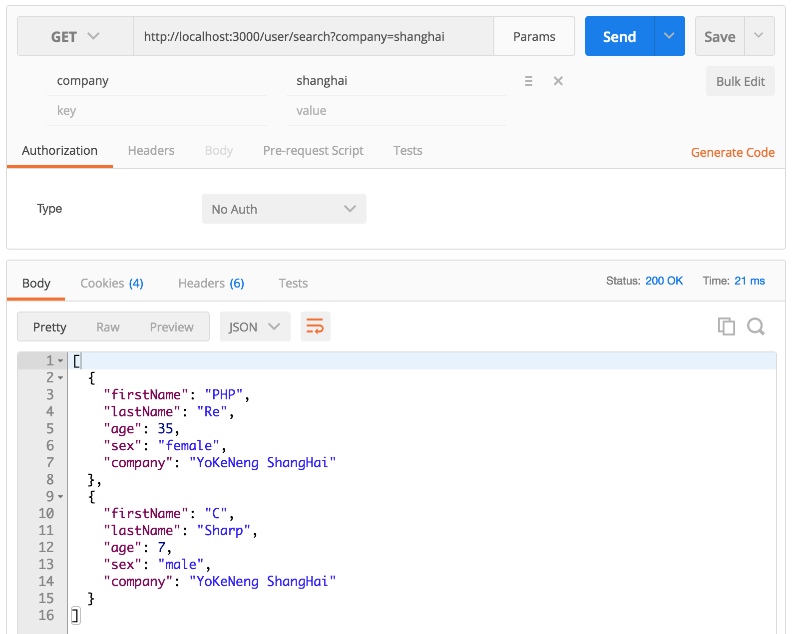

# Node.js web 服务搭建作业

1. 创建新项目
    1. 新建项目文件夹
    1. 初始化项目
    1. 安装 express 包
    1. 安装 body-parser 包
    1. 创建入口文件
1. 框架搭建
    1. 编辑入口文件（包引入，路由表，监听）
    1. 创建对应文件夹，copy 提供的 model 文件到对应目录
    1. 编写路由
1. 业务逻辑（路由）
    1. 用户 /user
        1. GET      /                       返回全部用户
        1. GET      /:id                    获取指定索引用户的全名（firstName + lastName)
        1. PUT      /:id                    修改指定索引用户的年龄（key 为 age，参考图1）
        1. GET      /:sex                   获取指定性别的人数统计（例: /user/male 返回 10）
        1. GET      /ageAvg                 返回所有用户年龄平均值
        1. GET      /search?company=xxx     搜索，返回公司名称包含搜索字符串的用户列表（忽略大小写，参考图2）
    1. 唱片 /album
        1. GET      /                       返回全部唱片
        1. GET      /:id                    返回指定索引的唱片数据
        1. PUT      /:id                    修改指定索引唱片的时长和标题（key 为 length 和 title，参考图3）
        1. GET      /longerSong             返回歌曲时间大于3分钟的歌曲
        1. GET      /singer/:name           返回指定歌手的全部歌曲
        1. GET      /search?class=xxx       获取指定分类下的歌曲列表（参考图4)
1. 测试
    - 在浏览器中访问所有路由表中 GET 方法的地址
    - 例如：
        - http://127.0.0.1:3000/user
        - http://127.0.0.1:3000/user/3
        - http://127.0.0.1:3000/user/male
        - http://127.0.0.1:3000/user/famale
        - http://127.0.0.1:3000/user/ageAvg
        - http://127.0.0.1:3000/search/geek
        - http://127.0.0.1:3000/search/beijing
        - http://127.0.0.1:3000/album
        - http://127.0.0.1:3000/album/4
        - http://127.0.0.1:3000/album/lognerSong
        - http://127.0.0.1:3000/album/郑钧
    - 在 Postman 中测试 PUT 接口
        - （参考图1 和 图3）

