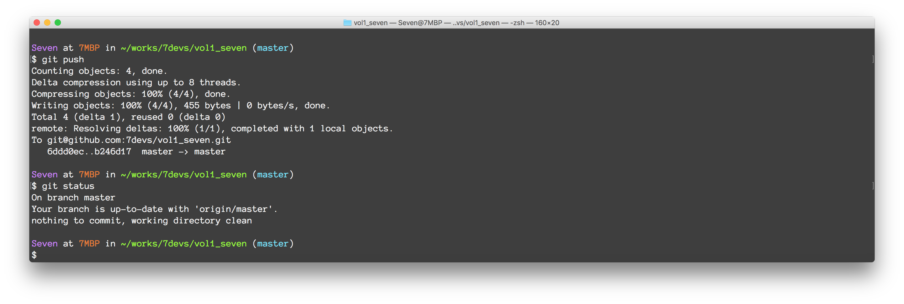

# Lesson 1

### terminal

terminal 一般被称为命令行工具或控制台，在没有 gui 工具的情况下（或者当运维人员工
作于远程服务器时）会通过控制台执行一些命令。

```bash
#切换工作目录
cd works
#列出当前目录文件
la
```


### github & git

git 是现代版本控制工具，于传统是 svn 相比有更多更灵活的功能。
github 是基于 git 的免费（公开）项目仓库服务。


```bash
#克隆项目到本地
git clone git@github.com:7devs/vol1_seven.git
cd vol1_seven
#查看项目修改状态
git status
#添加修改文件
git add .
#提交修改本地仓库
git commit -m 'message'
#提交修改到远程仓库
git push
#拉取更新
git pull
```



### vim

vim 是运行于控制台中（也有 gui 版本）的现代文本编辑器，由于其各项操作都通过快捷
键实现，不依赖鼠标，大大减少手部移动从而提高工作效率。

```bash
#编辑（新建）文件
vim README.md
```


### Atom

Atom 是 GitHub 出品的免费开源跨平台文本编辑器，拥有所有现代编辑器特征。


### Postman

Postman 是基于 Chrome 插件（App）形式的网络请求模拟工具，功能非常强大，用于接口
测试异常方便。


